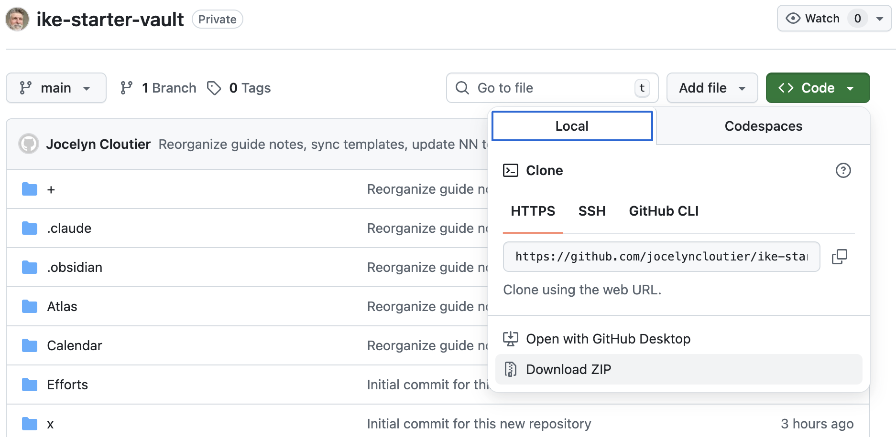
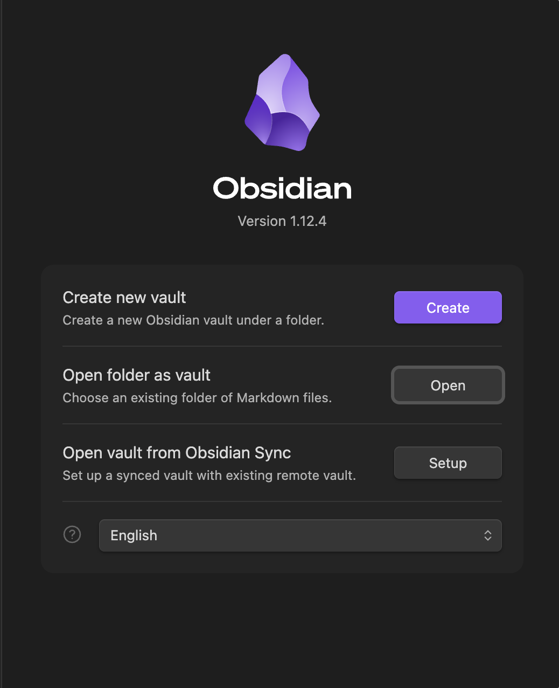
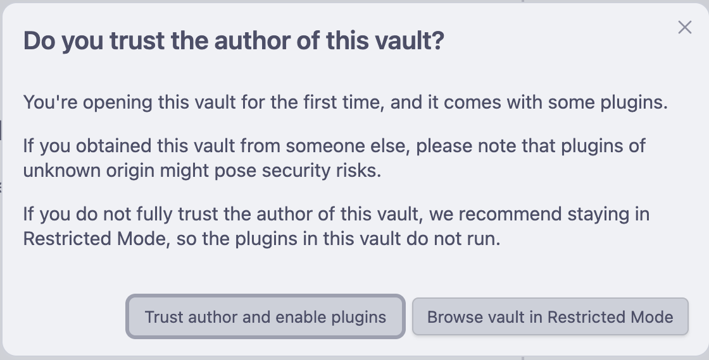
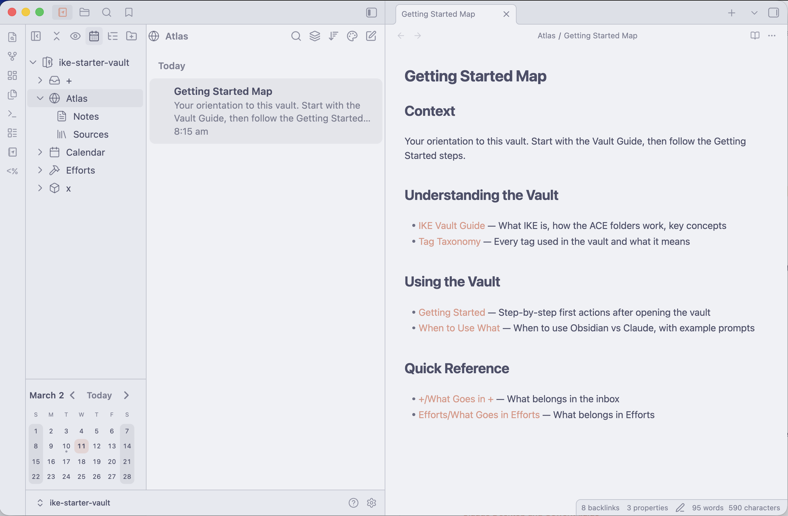

# IKE Starter Vault

A ready-to-use [Obsidian](https://obsidian.md) vault with a clean folder structure, note templates, and built-in AI support. This vault is pre-configured to work with Claude — so you can have natural-language conversations with your notes from day one. Open it and start capturing — no setup required.

## Step 1 — Get Obsidian

Download and install [Obsidian](https://obsidian.md/download) (free).

## Step 2 — Download and Place the Vault

Click the green **Code** button → **Download ZIP** (last option in the list). Unzip it and rename the folder to `MyVault` (or whatever you'd like to call your vault).



**Create a folder to store your vault, then move it there:**
- **macOS** — Create `~/Obsidian/` in your home folder, then move your vault there: `~/Obsidian/MyVault/`
- **Windows** — Create `C:\Users\YourName\Obsidian\`, then move your vault there: `C:\Users\YourName\Obsidian\MyVault\`

Remember where you put the vault — you'll need this path in Step 3.

## Step 3 — Open in Obsidian

Open Obsidian → **Open folder as vault** → select your vault folder (e.g., `~/Obsidian/MyVault/` on macOS or `C:\Users\YourName\Obsidian\MyVault\` on Windows).



When prompted, click **Trust author and enable plugins**.



A Settings window will open automatically — close it to see your vault.



## Step 4 — Set Up Claude (Recommended)

Claude is the AI assistant that helps you manage this vault. You interact with it through **Claudian**, a chat sidebar built into Obsidian — no terminal knowledge needed after initial setup.

### 4a — Install Claude Code

Claude Code is the engine behind Claudian. Install it once:

**macOS** — open Terminal, paste this, press Enter:
```
curl -fsSL https://claude.ai/install.sh | bash
```

**Windows** — open PowerShell, paste this, press Enter:
```
irm https://claude.ai/install.ps1 | iex
```

Log in with your Claude account when prompted (requires a Pro, Max, or Teams subscription). Verify with `claude doctor`.

### 4b — Connect Claude to Your Vault

Still in the terminal, navigate to your vault and start Claude Code:

**macOS:**
```
cd ~/Obsidian/MyVault
claude
```

**Windows:**
```
cd C:\Users\YourName\Obsidian\MyVault
claude
```

Replace `MyVault` with whatever you named your vault folder in Step 2.

### 4c — Configure Claudian

Once Claude Code is running, type:
```
/setup-claudian
```

This configures the Claudian sidebar automatically. Close the terminal when done — you won't need it again.

### 4d — Use Claudian

In Obsidian, the Claudian sidebar should be pinned in the right panel. If you don't see it: **Cmd+P** (macOS) or **Ctrl+P** (Windows) → type "Claudian" → select "Open Claudian."

**Try these first prompts:**
- *"What's in this vault?"* — Claude will orient you to the structure
- *"Create today's daily note"* — Creates a formatted daily note
- *"Create a note about [something you're thinking about]"* — Claude creates a properly structured note with links

## Learn More

- [Obsidian documentation](https://help.obsidian.md)
- [Claude Code setup guide](https://docs.anthropic.com/en/docs/claude-code/setup)
- New to Obsidian? [This intro video](https://www.youtube.com/watch?v=DbsAQSIKQXk) is a good place to start

## Versioning

This vault is versioned with git tags. See [Releases](https://github.com/jocelyncloutier/ike-starter-vault/releases) for the changelog.
